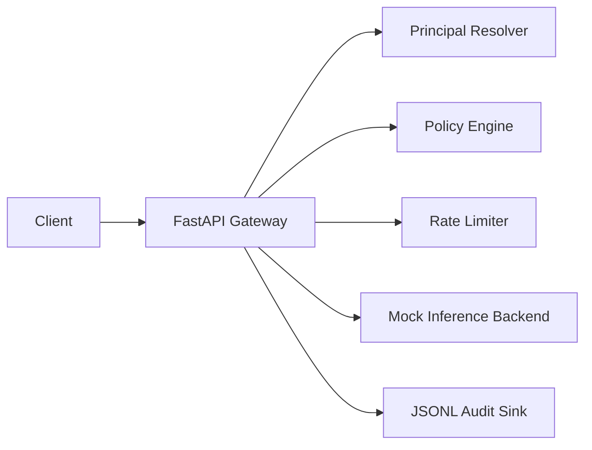

# Architecture

## Components

- `gateway/app.py`: HTTP API and request orchestration.
- `gateway/policy.py`: role and reason-for-access decisions.
- `gateway/rate_limit.py`: in-memory fixed-window rate limiter.
- `gateway/audit.py`: structured JSONL audit events.
- `gateway/mock_inference.py`: synthetic model response with latency metadata.
- `gateway/registry.py`: demo principals and model policies.

## Production Extensions

- Replace demo principals with OIDC/JWT verification.
- Add mTLS between gateway and model backends.
- Move policy definitions to OPA, Cedar, or a signed config bundle.
- Replace in-memory rate limiting with Redis or Envoy global rate limits.
- Emit OpenTelemetry traces and Prometheus metrics.
- Capture GPU telemetry from DCGM and attach it to inference metrics.
- Add per-model data handling rules and prompt/output redaction.

