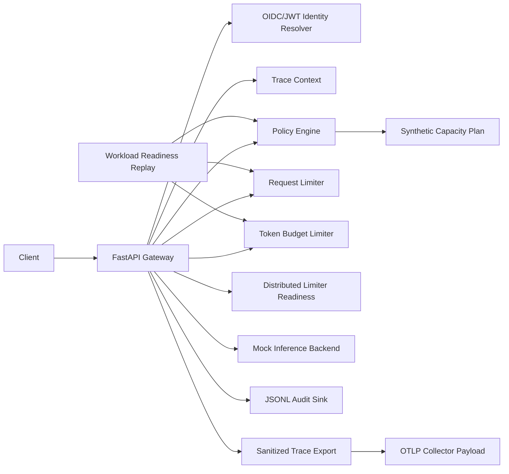

# Architecture

```mermaid
flowchart LR
    Client["Client"] --> API["FastAPI Gateway"]
    API --> Identity["OIDC/JWT Identity Resolver"]
    API --> Trace["Trace Context"]
    API --> Policy["Policy Engine"]
    API --> Limiter["Request Limiter"]
    API --> TokenBudget["Token Budget Limiter"]
    API --> DistLimit["Distributed Limiter Readiness"]
    API --> Model["Mock Inference Backend"]
    API --> Audit["JSONL Audit Sink"]
    API --> TraceExport["Sanitized Trace Export"]
    TraceExport --> Otlp["OTLP Collector Payload"]
    Policy --> Capacity["Synthetic Capacity Plan"]
    Replay["Workload Readiness Replay"] --> Policy
    Replay --> Limiter
    Replay --> TokenBudget
```

## Components

- `gateway/app.py`: HTTP API and request orchestration.
- `gateway/identity.py`: bearer JWT validation, role-claim mapping, and local demo-principal fallback.
- `gateway/trace_context.py`: W3C `traceparent` parsing, child-span generation, and response propagation.
- `gateway/policy.py`: role and reason-for-access decisions.
- `gateway/rate_limit.py`: memory-backed request/token controls by default plus
  optional Redis-backed atomic fixed-window controls.
- `gateway/token_budget.py`: deterministic estimated input-token accounting.
- `gateway/distributed_limiter.py`: Redis/Envoy migration readiness evidence for external request and token-budget controls.
- `gateway/audit.py`: structured JSONL audit events with identity and trace evidence.
- `gateway/trace_exporter.py`: opt-in sanitized trace spans and OTLP/HTTP collector payload generation.
- `gateway/otlp_export.py`: CLI for converting sanitized trace JSONL into checked collector-ready payloads.
- `gateway/workload_replay.py`: synthetic aggregate workload replay for guardrail coverage and local readiness gates.
- `gateway/capacity_plan.py`: synthetic capacity and cost-to-serve planning from model policy and benchmark assumptions.
- `gateway/mock_inference.py`: synthetic model response with latency metadata.
- `gateway/registry.py`: demo principals and model policies.
- `deploy/prometheus`, `deploy/otel-collector`, and `deploy/grafana`: local metrics scrape, trace collection, and dashboard provisioning.

## Production Extensions

- Replace local HS256 review tokens with JWKS-backed OIDC key rotation.
- Add mTLS between gateway and model backends.
- Move policy definitions to OPA, Cedar, or a signed config bundle.
- Wire the checked distributed-limiter readiness plan into Redis or Envoy global rate limits; the optional Redis path is now implemented, while Envoy remains a descriptor contract.
- Keep sanitized trace JSONL and OTLP/HTTP collector export aligned while using Prometheus metrics for low-cardinality service health.
- Capture GPU telemetry from DCGM and attach it to inference metrics.
- Replace synthetic capacity assumptions with measured backend profiles after real model-serving integration exists.
- Extend workload replay with backend error-rate, queue-depth, and resilience probes after a real serving adapter exists.
- Add per-model data handling rules and prompt/output redaction.
