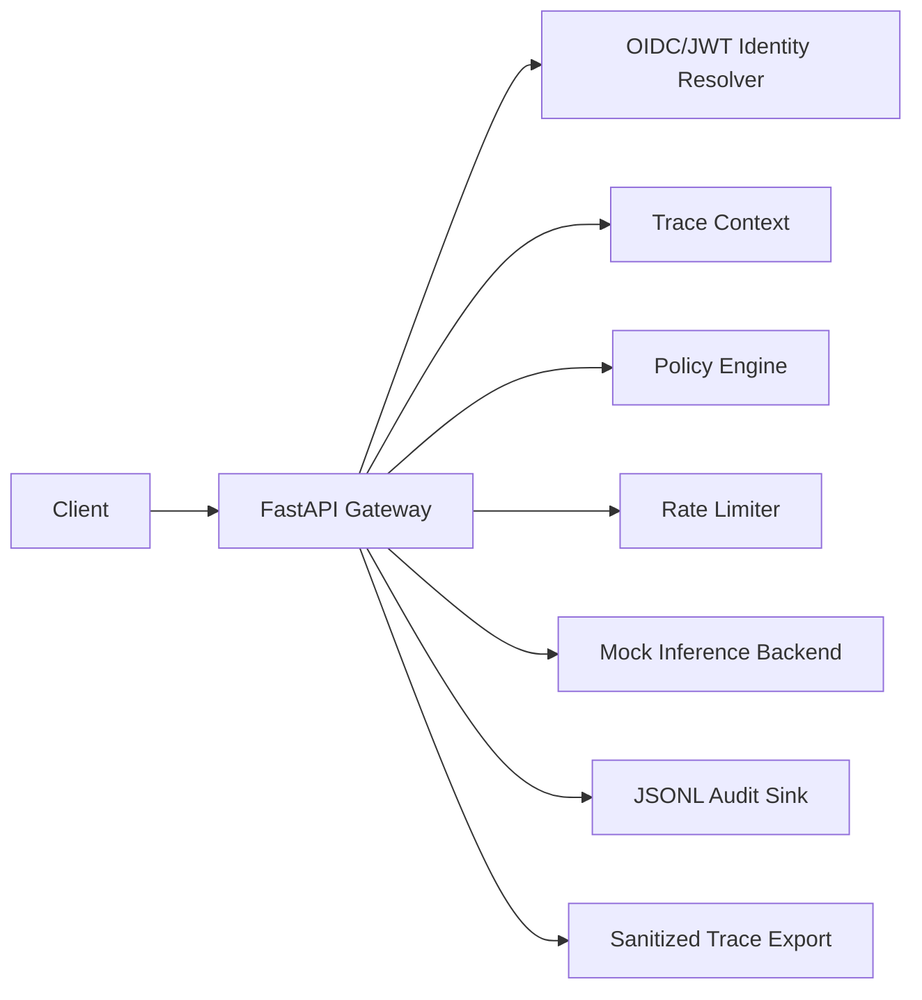

# Architecture

```mermaid
flowchart LR
    Client["Client"] --> API["FastAPI Gateway"]
    API --> Identity["OIDC/JWT Identity Resolver"]
    API --> Trace["Trace Context"]
    API --> Policy["Policy Engine"]
    API --> Limiter["Rate Limiter"]
    API --> Model["Mock Inference Backend"]
    API --> Audit["JSONL Audit Sink"]
    API --> TraceExport["Sanitized Trace Export"]
```

## Components

- `gateway/app.py`: HTTP API and request orchestration.
- `gateway/identity.py`: bearer JWT validation, role-claim mapping, and local demo-principal fallback.
- `gateway/trace_context.py`: W3C `traceparent` parsing, child-span generation, and response propagation.
- `gateway/policy.py`: role and reason-for-access decisions.
- `gateway/rate_limit.py`: in-memory fixed-window rate limiter.
- `gateway/audit.py`: structured JSONL audit events with identity and trace evidence.
- `gateway/trace_exporter.py`: opt-in sanitized trace spans for local OpenTelemetry-shaped evidence.
- `gateway/mock_inference.py`: synthetic model response with latency metadata.
- `gateway/registry.py`: demo principals and model policies.
- `deploy/prometheus` and `deploy/grafana`: local metrics scrape and dashboard provisioning.

## Production Extensions

- Replace local HS256 review tokens with JWKS-backed OIDC key rotation.
- Add mTLS between gateway and model backends.
- Move policy definitions to OPA, Cedar, or a signed config bundle.
- Replace in-memory rate limiting with Redis or Envoy global rate limits.
- Upgrade sanitized trace JSONL to OpenTelemetry SDK export through an OTLP collector while keeping Prometheus metrics for low-cardinality service health.
- Capture GPU telemetry from DCGM and attach it to inference metrics.
- Add per-model data handling rules and prompt/output redaction.
